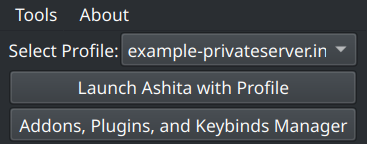
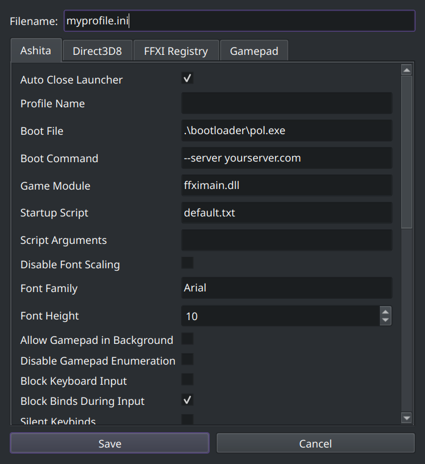
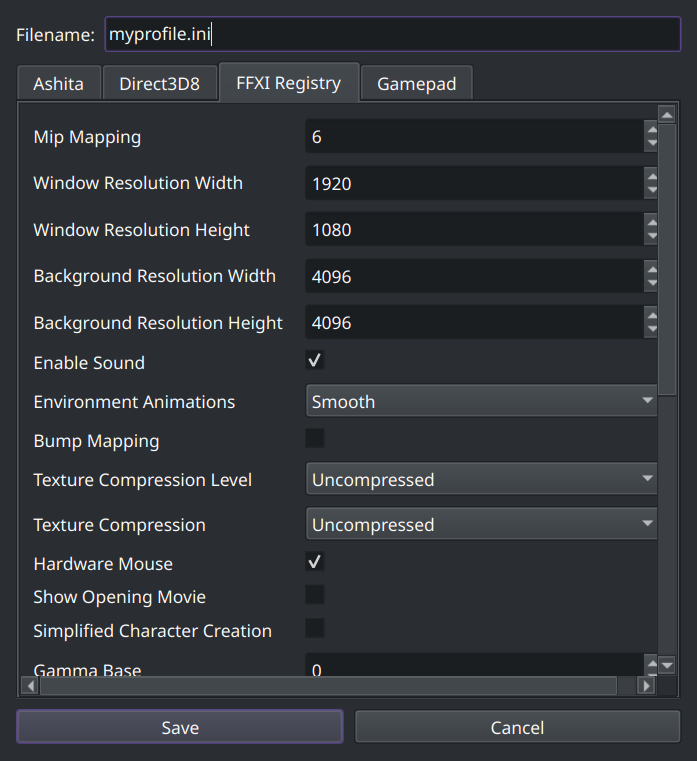
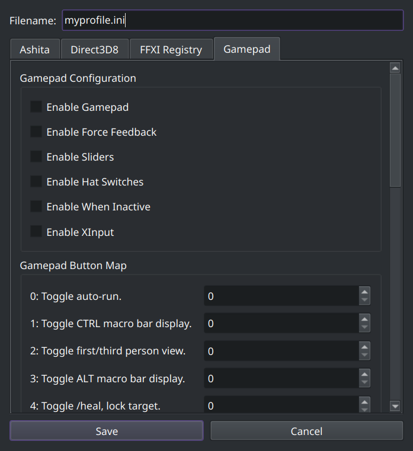
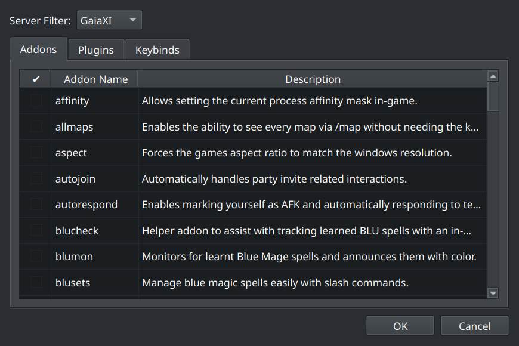
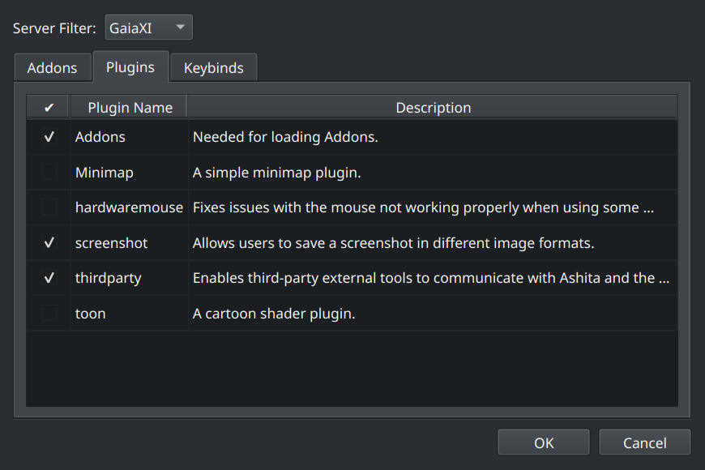
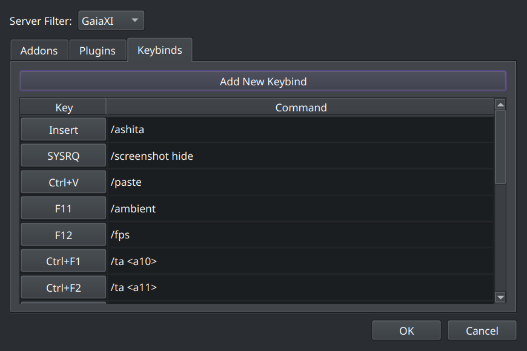

# AshitaV4Ui

AshitaV4Ui is a interface for managing INI files related to the Ashita v4 for Final Fantasy XI. 

## Project Structure

```
AshitaV4Ui
├── src
│   ├── Main.py          # Contains the main application logic.
│   └── ini_data.py      # Contains the INI key structure and tooltips for configuration settings.
└── README.md            # Documentation for the project.
```

## Features
- **Ashita Launching and downloading**: Launch existing profiles or those created with this tool
- **INI File Creation**: Users can create new INI files with predefined structures and default values.
- **Tooltips**: Each INI key has an associated tooltip that provides detailed information about its purpose and valid values.
- **


## Installation

1. Clone the repository:
   ```
   git clone https://git.salsinc.net/salnex/AshitaV4Ui/src/branch/main
   or
   Download it as a zip
   ```
2. Navigate to the project directory:
   ```
   cd AshitaV4Ui
   ```
3. Install the required dependencies:
   Python
   qtpy  
   PyQt6  
   requests
   pygame

## Usage

To run the application, execute the `Main.py` file. The application will provide a graphical interface for managing INI files.

## Screenshots
**Main Window**
[](Screenshots/MainWindowNew.png)
**INI Creation**
[](Screenshots/CreateINIWindowAshitaTab.png)
[](Screenshots/CreateINIWindowFFXIRegistryTab.png)
[](Screenshots/CreateINIWindowFFXIRegistryTab.png)
[](Screnshots/CreateINIWindowGamepadTab.png)
**Addons and Keybinds**
[](Screenshots/Addons.png)
[](Screenshots/Plugins.png)
[](Screenshots/Keybinds.png)

